# 🧩 Documentación del Pipeline CI/CD: Implementación GitOps con ArgoCD

El presente proyecto establece un flujo integral de **Integración Continua (CI)** y **Despliegue Continuo (CD)** para una aplicación *Guestbook* desarrollada en **Python/Flask**.  
Se adopta la metodología **GitOps** mediante el uso de **ArgoCD** para la sincronización automática del estado del clúster de Kubernetes (K8s) con la configuración declarativa contenida en un repositorio de manifiestos dedicado.

---

## 📑 Índice

1. [🗂️ Estructura del Proyecto y Repositorios](#️-1-estructura-del-proyecto-y-repositorios)  
   1.1 [📘 Repositorio de Código Fuente (`guestbook-cicd`)](#-repositorio-de-código-fuente-guestbook-cicd)  
   1.2 [🧾 Repositorio de Manifiestos (`guestbook-k8s-config`)](#-repositorio-de-manifiestos-gitops---guestbook-k8s-config)  
2. [⚙️ Flujo de Trabajo y Pipeline de CI/CD](#️-2-flujo-de-trabajo-y-pipeline-de-cicd)  
   2.1 [🔀 Descripción de la Lógica Git Flow](#-21-descripción-de-la-lógica-git-flow)  
   2.2 [🧩 Etapas del Pipeline](#-22-etapas-del-pipeline-githubworkflowsci-cdyml)  
   2.3 [📡 Ejecución y Monitorización del Workflow](#-23-ejecución-y-monitorización-del-workflow)  
3. [☸️ Prerrequisitos y Despliegue en K8s Local](#️-3-prerrequisitos-y-despliegue-en-k8s-local)  
   3.1 [Activar Cluster de K8s](#️-31-activar-cluster-de-k8s)  
   3.2 [Configuración de ArgoCD](#-32-configuración-de-argocd)  
   3.3 [🌐 Acceso a la Aplicación Desplegada](#-33-acceso-a-la-aplicación-desplegada)  
4. [🧹 Apagar o Eliminar la Aplicación](#-4-apagar-o-eliminar-la-aplicación)  
   4.1 [✅ Remoción Mediante GitOps](#-41-remoción-mediante-gitops-procedimiento-recomendado)  
   4.2 [🧨 Terminación del Clúster Local](#-42-terminación-del-clúster-local)  
5. [📋 Resumen y Listado de Entregables](#-5-resumen-y-listado-de-entregables)

---

## 🗂️ 1. Estructura del Proyecto y Repositorios

La arquitectura de la solución se fundamenta en la separación de responsabilidades mediante la utilización de **dos repositorios distintos**:

### 📘 1.1 Repositorio de Código Fuente (`guestbook-cicd`)
Contiene el código Python, el sistema de gestión de dependencias (`requirements.txt`), las unidades de prueba y el `Dockerfile`.

🔗 **URL:** [https://github.com/naesman1/guestbook-cicd.git](https://github.com/naesman1/guestbook-cicd.git)

---

### 🧾 1.2 Repositorio de Manifiestos (GitOps - `guestbook-k8s-config`)
Constituye el repositorio declarativo de los manifiestos de Kubernetes (`frontend-deployment.yaml`, `redis-service.yaml`, etc.).  
Este repositorio es la **Fuente de Verdad (Source of Truth)**, siendo objeto de monitorización constante por parte de **ArgoCD**.

🔗 **URL:** [https://github.com/naesman1/guestbook-k8s-config.git](https://github.com/naesman1/guestbook-k8s-config.git)

---

## ⚙️ 2. Flujo de Trabajo y Pipeline de CI/CD 

La orquestación del proceso CI/CD se realiza mediante **GitHub Actions**, aplicando la estrategia de ramificación **Git Flow** para la gestión del ciclo de vida del código.

---

### 🔀 2.1. Descripción de la Lógica Git Flow

| Rama | Flujo | Resultado |
|------|--------|------------|
| `develop` | Push / Pull Request | Ejecución exclusiva del pipeline de CI. Su propósito es validar la calidad del código, mitigando riesgos en producción. |
| `main` | Merge desde develop | Ejecución del pipeline integral de CI/CD. El despliegue se realiza solo si las validaciones de CI son exitosas. |

---

### 🧩 2.2. Etapas del Pipeline (`.github/workflows/ci-cd.yml`)

| Etapa (Job) | Descripción y Requisitos Cubiertos |
|--------------|------------------------------------|
| **ci (Integración Continua)** | Se ejecuta en las ramas `main`, `develop` y en eventos `pull_request`. Abarca: Tests unitarios, Informe de Cobertura, Linting (Flake8), Análisis Estático (SonarCloud) y Vulnerabilidades (Snyk). |
| **deploy (Despliegue Continuo)** | Activación condicionada a la rama `main`. Incluye: Construcción de Imagen Docker, Publicación en Docker Hub y actualización del manifiesto en el repositorio GitOps. |

---

### 📡 2.3. Ejecución y monitorización del workflow

- **Ejecución de CI (Desarrollo):**
   - Un `git push` a la rama `develop` inicia el pipeline de CI. Además, los Pull Requests contra `develop` o `main` también disparan la ejecución (el workflow escucha `pull_request`).
   - Se puede monitorear desde la pestaña **Actions** en GitHub y revisar el job `ci` (Checkout, Set up Python, Install dependencies, Lint, Tests, Snyk, SonarCloud).

- **Ejecución de CD (Despliegue):**
   - El job `deploy` está condicionado a ejecutarse solo en la rama `main` y solo si `ci` finaliza correctamente. 
   - El despliegue se produce al fusionar `develop` → `main` y hacer `git push origin main`. Tras el deploy, verifica en **ArgoCD** que `guestbook-app` transite los estados: `Synced → Progressing → Healthy`.

---

Comandos recomendados y atajos útiles (PowerShell)

- Forzar un trigger sin cambiar archivos (commit vacío):

```powershell
# Crea un commit vacío y lo empuja a la rama actual
git commit --allow-empty -m "CI test"
git push origin HEAD
```

- Push típico para CI (ejecutar en `develop`):

```powershell
# Añadir y commitear cambios
git add .
git commit -m "feat: cambios para CI"

# Push a la rama develop
git push origin develop
```

- Flujo para lanzar CD (fusionar develop → main y empujar):

```powershell
# Asegurarse de estar en develop y traer últimos cambios
git checkout develop
git pull origin develop

# Cambiar a main y traer últimos cambios
git checkout main
git pull origin main

# Fusionar develop en main
git merge --no-ff develop -m "Fusiona rama 'develop' con main"

# Push a la rama main (dispara el job de deploy)
git push origin main
```

---

## ☸️ 3. Prerrequisitos y Despliegue en K8s Local

### ☸️ 3.1 Activar Cluster de K8s:
  Esto es a elección del ususario (Kind, Minikube, Docker Desktop), en este caso usamos el cluster que habilita **Docker Desktop**

### ⚙️ 3.2. Configuración de ArgoCD

**Instalación de ArgoCD:**
```bash
kubectl create namespace argocd
kubectl apply -n argocd -f https://raw.githubusercontent.com/argoproj/argo-cd/stable/manifests/install.yaml
```

**Obtención de la Contraseña Inicial:**
```bash
kubectl -n argocd get secret argocd-initial-admin-secret -o jsonpath="{.data.password}" | base64 -d; echo
```

**Hacemos un portforwarding para poder abrir ArgoCD en nuestro navegador**
```bash
kubectl port-forward svc/argocd-server -n argocd 8080:443
```

**Acceso a la Interfaz Web**
Mientras el comando de *kubectl port-forward* se esté ejecutando (debe permanecer abierto en tu terminal), abre tu navegador y navega a la siguiente dirección:
```
https://localhost:8080
```

⚠️ Notas Importantes:
Certificado de Seguridad: El navegador te mostrará una advertencia de seguridad (certificado autofirmado). Debes aceptar la advertencia y continuar para poder acceder.

Credenciales: Usa las credenciales de administrador:

Username: admin

Password: *La contraseña que obtuviste anteriormente del secret de Kubernetes*

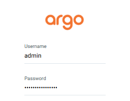

**🚀 Creación de la Aplicación guestbook-app en ArgoCD**

Una vez dentro de la interfaz web, debes hacer clic en el botón `+ NEW APP` en la esquina superior izquierda.

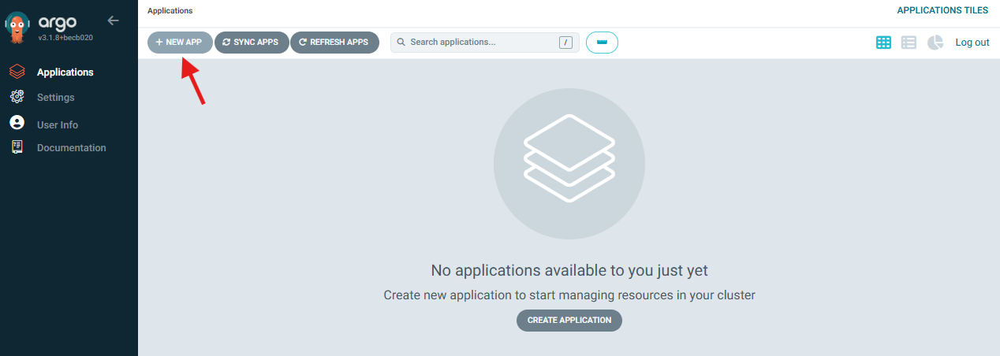

Para *General* ponemos: 


| Campo | Valor | Propósito |
|-------|-------|-----------|
| Application Name  | guestbook-app | El nombre que aparecerá en la interfaz de ArgoCD. |
| Project | default | El proyecto por defecto de ArgoCD.  |
| Sync Policy | Automatic  | Sincronización automática |

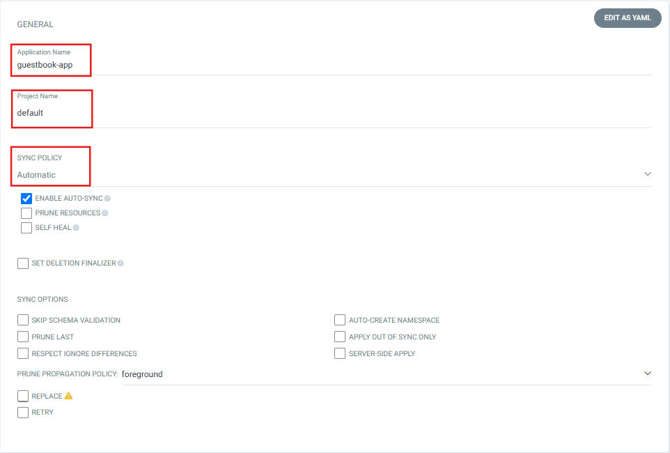

Configuración de *Source*

| Campo | Valor | Propósito  |
|-------|-------|------------|
| Repository URL | [https://github.com/naesman1/guestbook-k8s-config.git](https://github.com/naesman1/guestbook-k8s-config.git) | La URL de tu repositorio de manifiestos GitOps. |
| Revision | main | La rama (o etiqueta) que debe usar como fuente de verdad. Para producción, usa main.  |
| Path | k8s  | Crítico: Es la subcarpeta dentro del repositorio donde se encuentran todos tus archivos .yaml (frontend-deployment.yaml, etc.). |

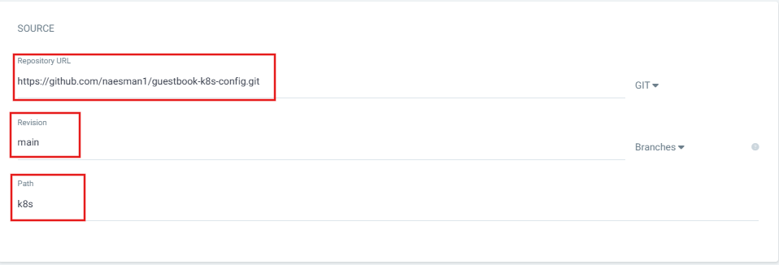

Configuración de *Directory*

| Campo | Valor | Propósito |
|-------|-------|-----------|
| Cluster URL | https://kubernetes.default.svc | Clúster Local: Si estás usando Kind o Docker Desktop K8s, este valor (el clúster interno) es el correcto. |
| Namespace | default | El namespace donde se crearán tus Deployments y Services.  |

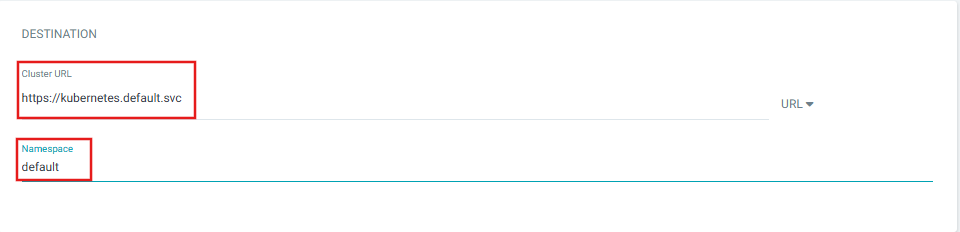

Después de llenar estos campos da clic en `CREATE` en la parte superior izquierda


---

### 🌐 3.3. Acceso a la Aplicación Desplegada

En una terminal nueva para no cerrar el túnel de ArgoCD

**Ejecución del Túnel:**
```bash
kubectl port-forward svc/guestbook-frontend 8088:80
```

**Acceso Web:**  
👉 [http://localhost:8088](http://localhost:8088)

---

## 🧹 4. Apagar o Eliminar la Aplicación

### ✅ 4.1. Remoción Mediante GitOps (Procedimiento Recomendado)

1. Acceder a la interfaz de **ArgoCD**.  
2. Seleccionar la aplicación `guestbook-app`.  
3. Pulsar la opción **DELETE (Eliminar)**.  

**Resultado:** ArgoCD elimina todos los recursos asociados (Deployments, Services, etc.), manteniendo la coherencia del estado del clúster.

---

### 🧨 4.2. Terminación del Clúster Local

**Con Kind:**
```bash
kind delete cluster --name kind
```

**Con Docker Desktop K8s:**
> Ir a `Settings > Kubernetes` y seleccionar **Reset Kubernetes Cluster**.

---

## 📋 5. Resumen y Listado de Entregables

| # | Entregable | Estado | Enlace / Ubicación |
|---|-------------|---------|--------------------|
| 1 | Enlace al Repositorio de Código | ✅ Completado | [https://github.com/naesman1/guestbook-cicd.git](https://github.com/naesman1/guestbook-cicd.git) |
| 2 | Enlace al Repositorio del artefacto | ✅ Completado | [https://hub.docker.com/repository/docker/mikenarbikes/guestbook-frontend/general](https://hub.docker.com/repository/docker/mikenarbikes/guestbook-frontend/general)  |
|   | |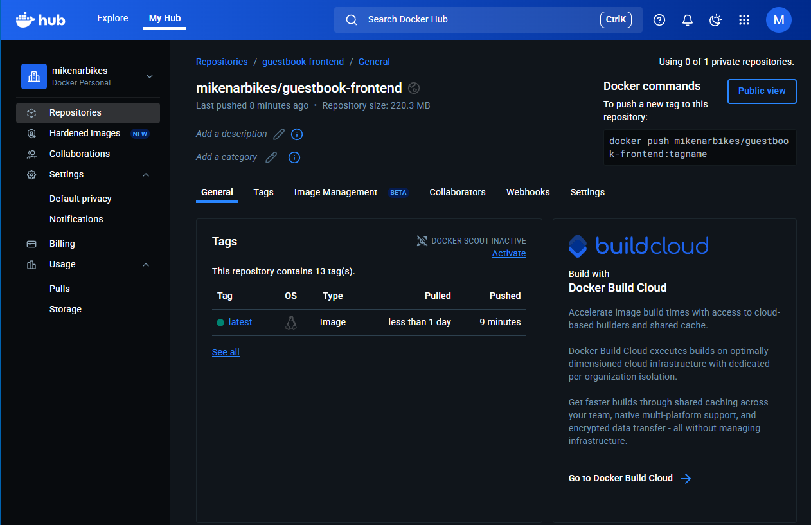 ||
| 3 | Fichero de Configuración del Pipeline | ✅ Completado | `.github/workflows/ci-cd.yml` |
| 4 | Screenshots del Pipeline de CI/CD | ✅ Completado | Pestaña **Actions** en GitHub |
|   | |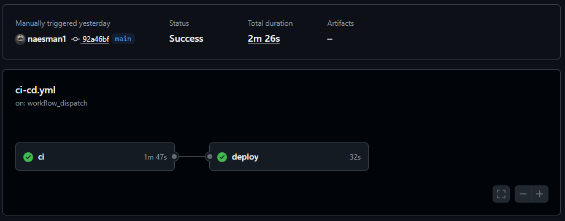 | CI Workflow  [Ver log](logs/CI-log.txt) <br> CD Workflow  [Ver log](logs/CD-log.txt)|
| 5 | Manifiestos de Kubernetes | ✅ Completado | [https://github.com/naesman1/guestbook-k8s-config.git](https://github.com/naesman1/guestbook-k8s-config.git) |
| 6 | Enlace/Screenshot de la Aplicación Desplegada | ✅ Completado | [http://localhost:8088](http://localhost:8088) |
|   | |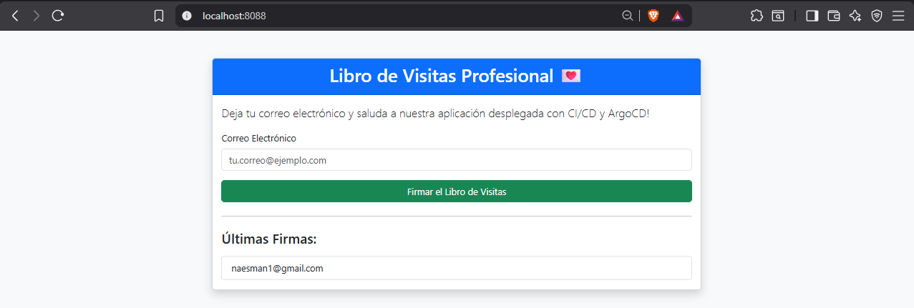 ||
| 7 | Enlace/Screenshot del Proyecto en ArgoCD | ✅ Completado | [https://localhost:8080](https://localhost:8080) |
|   | |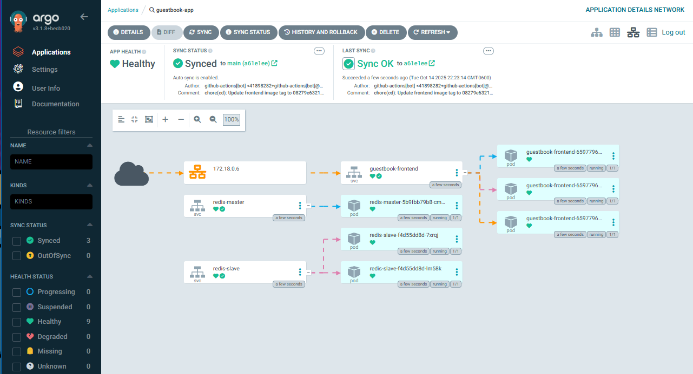 ||
| 8 | Proyecto en SonarCloud |  ✅ Completado | [https://sonarcloud.io/project/overview?id=naesman1_guestbook-cicd](https://sonarcloud.io/project/overview?id=naesman1_guestbook-cicd) |
|   | |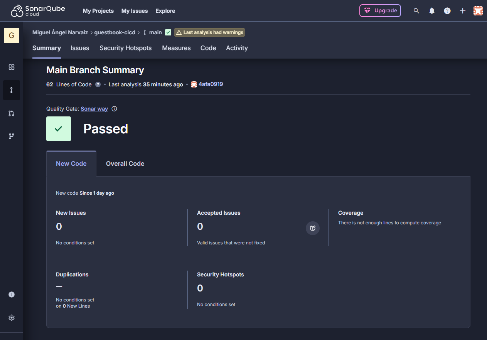 ||
| 9 | Proyecto en Snyk | ✅ Completado | [https://app.snyk.io/org/naesman1/projects](https://app.snyk.io/org/naesman1/projects) |
|   | |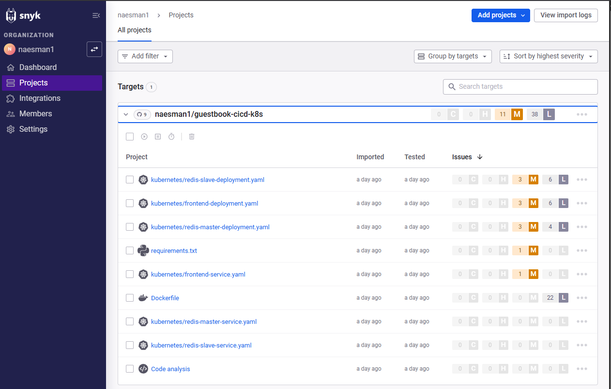 ||
| 10 | Vídeo Explicativo en YouTube | ⏳ Pendiente | `Tu enlace de YouTube` |

---

📘 **Autor:** [@naesman1](https://github.com/naesman1)  - Miguel Ángel Narvaiz 
🕓 **Última actualización:** Octubre 2025  
🚀 **Stack:** Python · Flask · Docker · Kubernetes · ArgoCD · GitHub Actions · SonarCloud · Snyk
